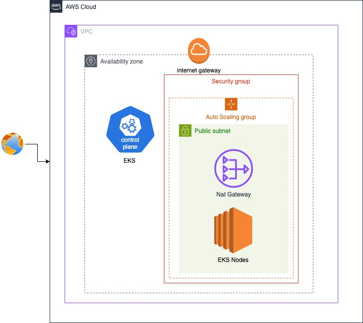

# CICD_PR_01_KUB_HELM_AWS - Infraestructura en AWS con Terraform

Este repositorio contiene la configuración de infraestructura como código (IaC) utilizando **Terraform** para desplegar recursos en **AWS**. El objetivo es proporcionar una infraestructura lista para ser utilizada en un flujo de CI/CD que incluya Kubernetes y Helm.

## Tabla de Contenidos

1. [Descripción del Proyecto](#descripción-del-proyecto)
2. [Arquitectura de la Infraestructura](#arquitectura-de-la-infraestructura)
3. [Requisitos Previos](#requisitos-previos)
4. [Configuración y Uso](#configuración-y-uso)
5. [Diagrama de Infraestructura](#diagrama-de-infraestructura)
6. [Contribuciones](#contribuciones)

---

## Descripción del Proyecto

Este proyecto utiliza **Terraform** para crear y gestionar recursos en AWS, específicamente:

- **VPC (Virtual Private Cloud)**: Una red virtual aislada para los recursos.
- **Subnets**: Subredes públicas y privadas dentro de la VPC.
- **Route Tables y Internet Gateway**: Configuración de tablas de rutas para permitir el acceso a Internet.
- **Security Groups**: Reglas de seguridad para controlar el tráfico entrante y saliente.
- **Clúster de Kubernetes (EKS)**: Se despliega un clúster de Kubernetes gestionado por AWS para ejecutar aplicaciones en contenedores. Se configuran grupos de nodos (workers) que forman parte del clúster EKS y ejecutan las cargas de trabajo.

La infraestructura está diseñada para ser modular y escalable, permitiendo su integración con herramientas de CI/CD como Jenkins, Kubernetes y Helm.

---

## Arquitectura de la Infraestructura

La infraestructura propuesta sigue una arquitectura básica en AWS que incluye los siguientes componentes:

1. **VPC**: Una red virtual aislada que actúa como el entorno principal.
2. **Subnets Públicas y Privadas**: Las subredes públicas son accesibles desde Internet, mientras que las privadas están aisladas.
3. **Internet Gateway**: Permite la comunicación entre la VPC y la red pública.
4. **Route Tables**: Define cómo se enruta el tráfico dentro de la VPC.
5. **Security Groups**: Actúan como firewalls para controlar el acceso a los recursos.
7. **lúster de Kubernetes (EKS)**: Clúster de Kubernetes gestionado por AWS.

### Diagrama de Infraestructura

Para visualizar la arquitectura, puedes agregar un diagrama que represente la infraestructura descrita. Aquí tienes un ejemplo de cómo podría verse el diagrama:

